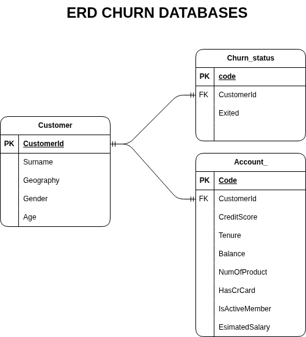

# Customer Churn Database Design (MySQL)

## Overview

Project ini berfokus pada proses **data preparation dan database normalization** untuk analisis churn customer. Data mentah diolah menjadi beberapa tabel terstruktur untuk meningkatkan efisiensi query dan integritas data.

---

## Objectives

* Melakukan data cleaning dari raw dataset
* Memecah data menjadi tabel terpisah (normalisasi)
* Membangun relasi antar tabel (foreign key)
* Menyiapkan database untuk analisis churn

---
# ERD

---

## Workflow

1. Import dataset mentah ke MySQL
2. Melakukan eksplorasi awal (cek struktur & jumlah data)
3. Validasi data (cek duplikasi CustomerId)
4. Normalisasi data menjadi beberapa tabel
5. Menambahkan primary key dan foreign key
6. Membangun relasi antar tabel

---
##  Database Design Concept

Struktur database mengikuti prinsip **normalisasi (hingga 3NF)**:

* Memisahkan data berdasarkan entitas (Customer, Account, Churn)
* Menghindari redundansi data
* Meningkatkan efisiensi query

---

## Key Insights (Data Preparation)

* Data mentah berhasil dipecah menjadi struktur relasional
* Setiap tabel memiliki peran spesifik (modular)
* Relasi antar tabel memungkinkan analisis multi-dimensi
* Database siap digunakan untuk EDA dan modeling

---

##  Notes & Improvements

##  Future Improvements

* Menambahkan indexing untuk performa query
* Menggunakan **ON DELETE CASCADE**
* Menambahkan constraint (NOT NULL, UNIQUE)
* Membuat ERD diagram
* Integrasi ke pipeline ETL

---

##  Conclusion

Project ini menunjukkan kemampuan dalam:

* Data cleaning menggunakan SQL
* Database normalization
* Relational database design
* Data preparation untuk analisis lanjutan

