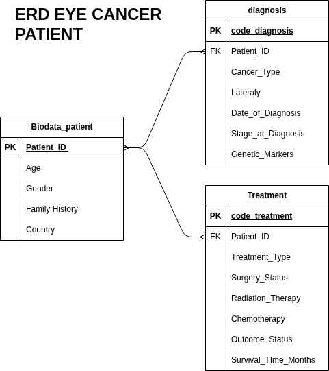

# Patient Cancer Data Analysis (MySQL)

##  Overview

Project ini berfokus pada pengolahan data pasien kanker dari dataset mentah menjadi database relasional yang terstruktur. Proses meliputi **data cleaning, penghapusan duplikasi, normalisasi, dan pembuatan relasi antar tabel** menggunakan MySQL.

---

##  Objectives

* Membersihkan data dari duplikasi
* Memisahkan data berdasarkan entitas (normalisasi)
* Membangun relasi antar tabel
* Menyiapkan database untuk analisis medis

---
# ERD

##  Workflow

1. Import dataset mentah
2. Eksplorasi struktur data
3. Normalisasi menjadi 3 tabel utama
4. Menghapus data duplikat
5. Menambahkan primary key
6. Membangun relasi antar tabel

---

##  Database Design Concept

Struktur database mengikuti prinsip:

* **Normalization (3NF)**
* Pemisahan entitas (Patient, Diagnosis, Treatment)
* Menghindari redundansi data
* Mendukung query analisis yang kompleks

---

##  Key Insights (Data Engineering)

* Data berhasil dibersihkan dari duplikasi berdasarkan `Patient_ID`
* Struktur database lebih efisien dan scalable
* Relasi antar tabel memungkinkan analisis longitudinal (diagnosis → treatment → outcome)

---

## Future Improvements

* Menambahkan indexing
* Query analisis lanjutan (survival rate, treatment effectiveness)
* Integrasi ke Python untuk machine learning
* Dashboard visualisasi (Power BI / Looker Studio)

---

##  Conclusion

Project ini menunjukkan kemampuan dalam:

* Data cleaning menggunakan SQL
* Database normalization
* Relational database design
* Data preparation untuk analisis kesehatan
